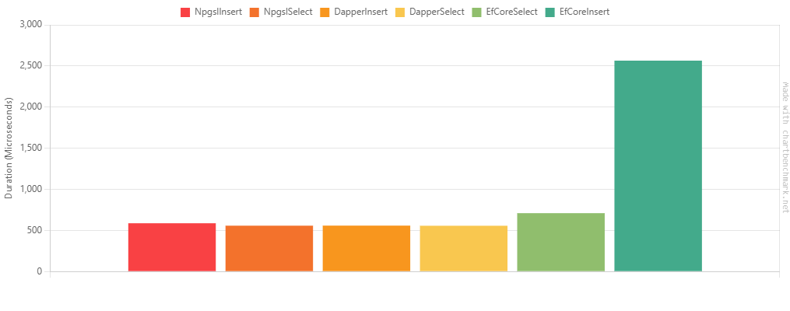
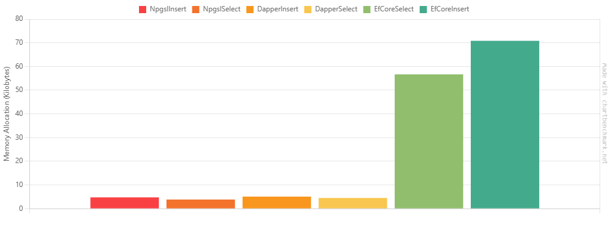

## Benchmark

Для сравнения выбраны три ORM для языка C#:

- **Npgsql** - обычная библиотека работы с реляционными базами данных;
- **Dapper** - созданная StackExchange библиотека для быстрых запросов к базе, который позволяет запрашивать базы данных с помощью обычного SQL и сопоставлять их с объектами C#;
- **Entity Framework Core** (EFCore) - это большая полнофункциональная платформа ORM от Microsoft.

Параметры сравнения:

- Время на выборку (select)
- Время на запись (insert)
- Число GC пауз
- Количество затраченной памяти на выборку и запись

Для бенчмарка используется фреймворк [Benchmark.DotNet](https://benchmarkdotnet.org).

Под каждый бенчмарк создавалась отдельная база данных в отдельном контейнере с помощью testcontainers. Принудительно указано число итераций каждого бенчмарка - 100. На основании получаемых метрик `Benchmark.DotNet`` автоматически расчитывает среднее значение, медиану, среднеквадратическое отклонение случайных величин (время, количество памяти).

```
Compare.NpgslInsert: Job-OVQBKV(IterationCount=100, LaunchCount=1)
Runtime = .NET 8.0.8 (8.0.824.36612), X64 RyuJIT AVX-512F+CD+BW+DQ+VL+VBMI; GC = Concurrent Workstation
Mean = 586.949 us, StdErr = 1.620 us (0.28%), N = 93, StdDev = 15.619 us
Min = 532.202 us, Q1 = 577.609 us, Median = 584.529 us, Q3 = 595.727 us, Max = 627.605 us
IQR = 18.117 us, LowerFence = 550.433 us, UpperFence = 622.903 us
ConfidenceInterval = [581.444 us; 592.455 us] (CI 99.9%), Margin = 5.506 us (0.94% of Mean)
Skewness = 0.18, Kurtosis = 4, MValue = 2
-------------------- Histogram --------------------
[527.678 us ; 546.574 us) | @
[546.574 us ; 559.994 us) | @
[559.994 us ; 580.054 us) | @@@@@@@@@@@@@@@@@@@@@@@@@@@@@
[580.054 us ; 603.385 us) | @@@@@@@@@@@@@@@@@@@@@@@@@@@@@@@@@@@@@@@@@@@@@@@@
[603.385 us ; 632.130 us) | @@@@@@@@@@@@@@

---

Compare.NpgslSelect: Job-OVQBKV(IterationCount=100, LaunchCount=1)
Runtime = .NET 8.0.8 (8.0.824.36612), X64 RyuJIT AVX-512F+CD+BW+DQ+VL+VBMI; GC = Concurrent Workstation
Mean = 557.404 us, StdErr = 1.349 us (0.24%), N = 100, StdDev = 13.491 us
Min = 533.347 us, Q1 = 548.437 us, Median = 556.201 us, Q3 = 567.002 us, Max = 593.451 us
IQR = 18.565 us, LowerFence = 520.590 us, UpperFence = 594.850 us
ConfidenceInterval = [552.828 us; 561.979 us] (CI 99.9%), Margin = 4.575 us (0.82% of Mean)
Skewness = 0.49, Kurtosis = 2.56, MValue = 2
-------------------- Histogram --------------------
[533.179 us ; 552.883 us) | @@@@@@@@@@@@@@@@@@@@@@@@@@@@@@@@@@@@@@@@@@@
[552.883 us ; 564.827 us) | @@@@@@@@@@@@@@@@@@@@@@@@@@@@@@
[564.827 us ; 597.265 us) | @@@@@@@@@@@@@@@@@@@@@@@@@@@

---

Compare.DapperInsert: Job-OVQBKV(IterationCount=100, LaunchCount=1)
Runtime = .NET 8.0.8 (8.0.824.36612), X64 RyuJIT AVX-512F+CD+BW+DQ+VL+VBMI; GC = Concurrent Workstation
Mean = 558.164 us, StdErr = 1.507 us (0.27%), N = 94, StdDev = 14.613 us
Min = 522.944 us, Q1 = 548.142 us, Median = 559.140 us, Q3 = 567.046 us, Max = 594.123 us
IQR = 18.904 us, LowerFence = 519.786 us, UpperFence = 595.402 us
ConfidenceInterval = [553.042 us; 563.286 us] (CI 99.9%), Margin = 5.122 us (0.92% of Mean)
Skewness = 0.11, Kurtosis = 2.89, MValue = 2
-------------------- Histogram --------------------
[518.726 us ; 534.740 us) | @@@@@
[534.740 us ; 553.161 us) | @@@@@@@@@@@@@@@@@@@@@@@@@@@@@
[553.161 us ; 576.594 us) | @@@@@@@@@@@@@@@@@@@@@@@@@@@@@@@@@@@@@@@@@@@@@@@@@@@
[576.594 us ; 596.403 us) | @@@@@@@@@

---

Compare.DapperSelect: Job-OVQBKV(IterationCount=100, LaunchCount=1)
Runtime = .NET 8.0.8 (8.0.824.36612), X64 RyuJIT AVX-512F+CD+BW+DQ+VL+VBMI; GC = Concurrent Workstation
Mean = 556.627 us, StdErr = 1.373 us (0.25%), N = 90, StdDev = 13.025 us
Min = 536.671 us, Q1 = 547.902 us, Median = 555.106 us, Q3 = 561.092 us, Max = 593.375 us
IQR = 13.190 us, LowerFence = 528.117 us, UpperFence = 580.877 us
ConfidenceInterval = [551.955 us; 561.300 us] (CI 99.9%), Margin = 4.673 us (0.84% of Mean)
Skewness = 1.1, Kurtosis = 3.91, MValue = 2
-------------------- Histogram --------------------
[532.856 us ; 553.174 us) | @@@@@@@@@@@@@@@@@@@@@@@@@@@@@@@@@@@@@@@@@
[553.174 us ; 571.385 us) | @@@@@@@@@@@@@@@@@@@@@@@@@@@@@@@@@@@@
[571.385 us ; 595.495 us) | @@@@@@@@@@@@@

---

Compare.EfCoreSelect: Job-OVQBKV(IterationCount=100, LaunchCount=1)
Runtime = .NET 8.0.8 (8.0.824.36612), X64 RyuJIT AVX-512F+CD+BW+DQ+VL+VBMI; GC = Concurrent Workstation
Mean = 709.680 us, StdErr = 2.076 us (0.29%), N = 93, StdDev = 20.023 us
Min = 671.698 us, Q1 = 695.478 us, Median = 706.390 us, Q3 = 720.858 us, Max = 764.693 us
IQR = 25.380 us, LowerFence = 657.408 us, UpperFence = 758.928 us
ConfidenceInterval = [702.621 us; 716.738 us] (CI 99.9%), Margin = 7.058 us (0.99% of Mean)
Skewness = 0.72, Kurtosis = 2.97, MValue = 2
-------------------- Histogram --------------------
[669.695 us ; 685.133 us) | @@@@@
[685.133 us ; 712.824 us) | @@@@@@@@@@@@@@@@@@@@@@@@@@@@@@@@@@@@@@@@@@@@@@@@@@@@@@@
[712.824 us ; 729.098 us) | @@@@@@@@@@@@@@@@@@@@
[729.098 us ; 770.493 us) | @@@@@@@@@@@@@

---

Compare.EfCoreInsert: Job-OVQBKV(IterationCount=100, LaunchCount=1)
Runtime = .NET 8.0.8 (8.0.824.36612), X64 RyuJIT AVX-512F+CD+BW+DQ+VL+VBMI; GC = Concurrent Workstation
Mean = 2.565 ms, StdErr = 0.031 ms (1.20%), N = 100, StdDev = 0.308 ms
Min = 1.941 ms, Q1 = 2.287 ms, Median = 2.638 ms, Q3 = 2.803 ms, Max = 3.291 ms
IQR = 0.516 ms, LowerFence = 1.513 ms, UpperFence = 3.578 ms
ConfidenceInterval = [2.461 ms; 2.669 ms] (CI 99.9%), Margin = 0.104 ms (4.07% of Mean)
Skewness = -0.3, Kurtosis = 2.19, MValue = 2.38
-------------------- Histogram --------------------
[1.917 ms ; 2.121 ms) | @@@@@@@@@
[2.121 ms ; 2.296 ms) | @@@@@@@@@@@@@@@@@
[2.296 ms ; 2.504 ms) | @@@@@@@@@@@@@@@
[2.504 ms ; 2.674 ms) | @@@@@@@@@@@@@
[2.674 ms ; 2.848 ms) | @@@@@@@@@@@@@@@@@@@@@@@@@@@@@@@@
[2.848 ms ; 3.038 ms) | @@@@@@@@@@@@
[3.038 ms ; 3.130 ms) |
[3.130 ms ; 3.305 ms) | @@

---
```

BenchmarkDotNet v0.14.0, Windows 10 (10.0.19045.5131/22H2/2022Update)
11th Gen Intel Core i7-1165G7 2.80GHz, 1 CPU, 8 logical and 4 physical cores
.NET SDK 8.0.400
[Host] : .NET 8.0.8 (8.0.824.36612), X64 RyuJIT AVX-512F+CD+BW+DQ+VL+VBMI
Job-OVQBKV : .NET 8.0.8 (8.0.824.36612), X64 RyuJIT AVX-512F+CD+BW+DQ+VL+VBMI

IterationCount=100 LaunchCount=1

```
| Method       |       Mean |     Error |    StdDev |   Gen0 | Allocated |
| ------------ | ---------: | --------: | --------: | -----: | --------: |
| NpgslInsert  |   586.9 us |   5.51 us |  15.62 us |      - |   4.76 KB |
| NpgslSelect  |   557.4 us |   4.58 us |  13.49 us | 0.4883 |   3.85 KB |
| DapperInsert |   558.2 us |   5.12 us |  14.61 us |      - |   5.08 KB |
| DapperSelect |   556.6 us |   4.67 us |  13.03 us |      - |   4.51 KB |
| EfCoreSelect |   709.7 us |   7.06 us |  20.02 us | 8.7891 |  56.69 KB |
| EfCoreInsert | 2,565.0 us | 104.44 us | 307.95 us | 7.8125 |  70.84 KB |
```





// _ Hints _
Outliers
Compare.NpgslInsert: IterationCount=100, LaunchCount=1 -> 7 outliers were removed, 8 outliers were detected (532.21 us, 636.41 us..681.78 us)
Compare.DapperInsert: IterationCount=100, LaunchCount=1 -> 6 outliers were removed (604.80 us..678.92 us)
Compare.DapperSelect: IterationCount=100, LaunchCount=1 -> 10 outliers were removed (601.19 us..700.80 us)
Compare.EfCoreSelect: IterationCount=100, LaunchCount=1 -> 7 outliers were removed (767.80 us..881.41 us)

// _ Legends _
Mean : Arithmetic mean of all measurements
Error : Half of 99.9% confidence interval
StdDev : Standard deviation of all measurements
Gen0 : GC Generation 0 collects per 1000 operations
Allocated : Allocated memory per single operation (managed only, inclusive, 1KB = 1024B)
1 us : 1 Microsecond (0.000001 sec)

// _ Diagnostic Output - MemoryDiagnoser _

// **\*** BenchmarkRunner: End **\***
Run time: 00:08:36 (516.16 sec), executed benchmarks: 6

Global total time: 00:08:48 (528.14 sec), executed benchmarks: 6
// _ Artifacts cleanup _
Artifacts cleanup is finished
BenchmarkDotNet.Reports.Summary

```

```
